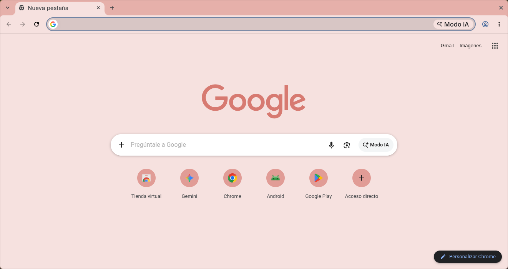

# Minimalist Beetroot Juice 🍆

A minimal Chrome theme in a calm, dusty-rose palette, by Miguel Euraque.

The frame and buttons sit in a soft dusty rose, the toolbar and new tab page fade into a pale blush, and the text stays a warm gray. It reads like a quiet, earthy red rather than a loud pink.

## Features

- **Palette:** muted rose frame and buttons, pale blush surfaces, warm gray text
- **Minimalist design:** clean and uncluttered
- **Easy installation:** Chrome Manifest V3
- **Gentle on the eyes:** low-contrast colors that stay easy to read

## Installation

### Chrome Web Store (recommended)

1. Visit the [Minimalist Beetroot Juice](https://chromewebstore.google.com/detail/minimalist-beetroot-juice/cpjcoggfdlmjckcankijlakeallfnebf) page in the Chrome Web Store.
2. Click **Add to Chrome**.

### From source

1. Clone this repository.
2. Open `chrome://extensions` and turn on Developer mode.
3. Click **Load unpacked** and select the theme folder.
